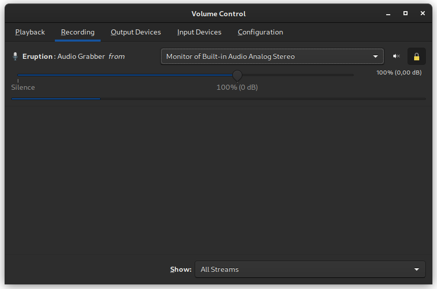

# Table of Contents

- [Table of Contents](#table-of-contents)
    - [Support for Audio Playback and Capture](#support-for-audio-playback-and-capture)
    - [The `eruption-audio-proxy` Daemon](#the-eruption-audio-proxy-daemon)

## Support for Audio Playback and Capture

Eruption currently has built-in support for the following audio APIs:

* `PipeWire` (via the `PulseAudio` interface of `PipeWire`)
* `PulseAudio`

Audio support is provided by `eruption-audio-proxy.service` session daemon.

## The `eruption-audio-proxy` Daemon

As of Eruption `0.1.23` it is no longer necessary to grant the `root` user full access to the `PipeWire` or `PulseAudio`
session instance. Therefore, it is no longer required to edit configuration files. Just enable the `eruption-audio-proxy`
session daemon, and assign a device monitor to listen on, e.g. by using `pavucontrol`.

```shell
systemctl --user enable --now eruption-audio-proxy.service
```
> NOTE: Please _do not use `sudo`_ in front of the command since it has to act on the session instance of systemd

Next, switch to a profile that utilizes the audio API of Eruption:
```shell
eruptionctl switch profile spectrum-analyzer-swirl.profile
```

Then use `pavucontrol` to assign a monitor of an audio device to the Eruption audio grabber.


> NOTE: You have to select a profile that makes use auf the audio grabber first, otherwise the
> `eruption-audio-proxy` will not open an audio device for recording, and therefore will not be listed
