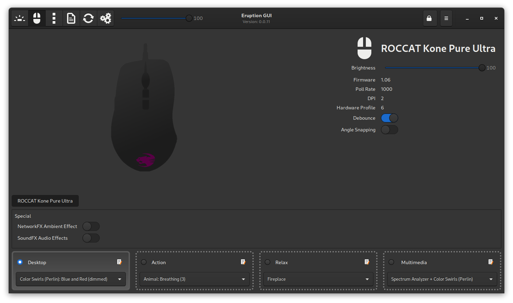
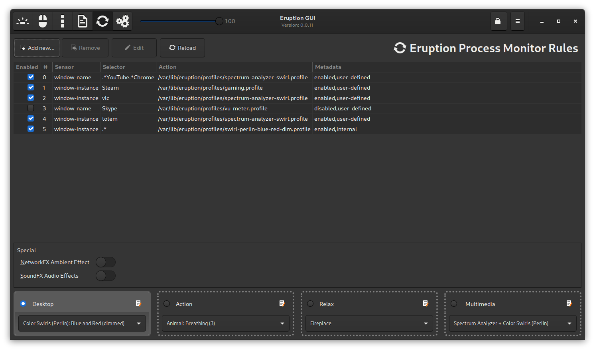
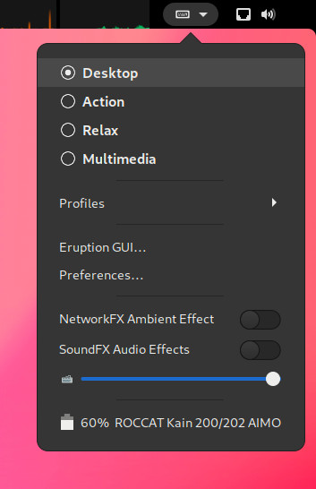
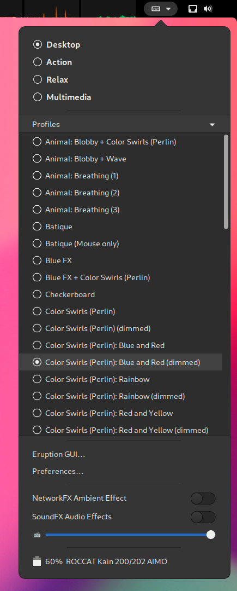

# Table of Contents

- [Table of Contents](#table-of-contents)
  - [Introduction](#introduction)
  - [Features Overview](#features-overview)
  - [System requirements](#system-requirements)
    - [What does Eruption need to run?](#what-does-eruption-need-to-run)
  - [Recovering from Errors](#recovering-from-errors)
  - [Core Concepts](#core-concepts)
    - [Profiles, Slots and Lua Scripts](#profiles-slots-and-lua-scripts)
  - [Eruption Components](#eruption-components)
    - [The `eruption` daemon](#the-eruption-daemon)
    - [The `eruption-audio-proxy` daemon](#the-eruption-audio-proxy-daemon)
    - [The `eruption-process-monitor` daemon](#the-eruption-process-monitor-daemon)
  - [Eruption CLI Utilities](#eruption-cli-utilities)
    - [eruptionctl](#eruptionctl)
    - [eruption-netfx](#eruption-netfx)
  - [Eruption GUI](#eruption-gui)
    - [Keyboard](#keyboard)
    - [Mice](#mice)
    - [Other Devices](#other-devices)
    - [Rules](#rules)
    - [Battery Stats](#battery-stats)
  - [GNOME Shell Extension](#gnome-shell-extension)
  - [The Macro System](#the-macro-system)
    - [Macros (accessible via the FN Key)](#macros-accessible-via-the-fn-key)
      - [Macro Keys](#macro-keys)
    - [Easy Shift+](#easy-shift)
      - [Special (Media) Keys](#special-media-keys)
      - [Assignable Easy Shift Macros (up to 6 Layers)](#assignable-easy-shift-macros-up-to-6-layers)
  - [Extending Eruption (using the SDK)](#extending-eruption-using-the-sdk)
    - [Python SDK](#python-sdk)
    - [Rust SDK](#rust-sdk)
    - [C++ SDK](#c-sdk)
  - [Reporting Bugs](#reporting-bugs)

## Introduction

Eruption ships with many features, some of which are not obvious or self-explanatory.
This handbook has been written in the hopes to make more of the features accessible to the users of Eruption.

## Features Overview

- Integrated Lua interpreter
- LED Control via Lua scripts
- Macros via Lua scripts
- Multiple Lua scripts may be executed in parallel, with their outputs and effects combined
- Allows for construction of complex "effect pipelines"
- Event-based architecture
- Daemon plugins may export functions to Lua
- Profiles may be switched at runtime via a D-Bus method
- A GNOME based profile switcher extension is available

## System requirements

### What does Eruption need to run?

- Some of the profiles require a CPU built later than 2015 with support for SIMD/AVX2

## Recovering from Errors

This project is still in an early stage of development, and thus may contain some possibly serious bugs.

If you ever need to forcefully disable the Eruption daemon you may do so by adding
the following text snippet to the bootloader's (e.g. GRUB) kernel command line:

```shell
systemd.mask=eruption.service
```

Or with systemctl to mask the service:

```shell
sudo systemctl mask eruption.service
```

You can always re-enable the Eruption service with the command:

```shell
sudo systemctl unmask eruption.service
```

## Core Concepts

The following concepts are essential to using `Eruption`.

### Profiles, Slots and Lua Scripts

- Lua scripts and their corresponding metadata files (manifests) are the basic building block of the effects provided by Eruption.
- Profiles combine one or multiple Lua scripts to a logical unit, and are able to override the exposed parameters of each of the scripts.
- A single profile can be assigned to a slot. A slot can be activated via `FN` + `F1` up to `FN` + `F4`.

This means that you can assign up to 4 slots which may be quickly switched between by using the aforementioned hotkeys.

## Eruption Components

### The `eruption` daemon

Implements the core functionality of Eruption. It provides the basic functionality like a support API written in Rust,
as well as an embedded Lua interpreter. It needs special elevated privileges to access the hardware of your system.
Normally runs as the `root` user. It makes use of realtime scheduling where available, to reduce input lag (latency).
The daemon proper provides a `D-Bus` based API as well as an interface exposed over UNIX Domain sockets, for use by
the session daemons and the `Eruption SDK` as well.

Further reading: [Eruption software architecture](ARCHITECTURE.md)

### The `eruption-audio-proxy` daemon

Provides support for audio related tasks. Runs in the session of the currently logged in user.

- Notifies the `eruption` daemon about changes in the audio subsystem e.g.: `Muted` or `Unmuted` state
- Audio SFX playback, used for the Sound FX feature
- Audio stream capture, used for RMS calculation (Loudness) and audio Spectrum Analyzer (Fourier Transform/FFT calculation)

> To enable the session daemon please run this command, logged in as your Linux user (without sudo in front of it)

```sh
systemctl --user enable --now eruption-audio-proxy.service
```

### The `eruption-process-monitor` daemon

Watches for process execution events as well as changes to the top level window state on X11 or Wayland.
Runs in the session of the currently logged in user.

- Tells the `eruption` daemon what profiles or slots to activate, based on usage activity of the system.

With this feature you are able to automatically switch between profiles, e.g. when a certain window gains focus.

> To enable the session daemon please run this command, logged in as your Linux user (without sudo in front of it)

```sh
systemctl --user enable --now eruption-process-monitor.service
```

> To add a rule you may either use the `Eruption GUI` or via the CLI:

```sh
eruption-process-monitor rules add window-name '.*YouTube.*Google Chrome' /var/lib/eruption/profiles/spectrum-analyzer-swirl.profile
```

This will switch to the Spectrum Analyzer as soon as you activate a YouTube tab in the Google Chrome browser.

> To list all rules via the CLI, please run:

```sh
eruption-process-monitor rules list
```

## Eruption CLI Utilities

### eruptionctl

```sh
eruptionctl switch profile /var/lib/eruption/profiles/swirl-perlin-rainbow.profile
```

Or the shortened form:

```sh
eruptionctl switch profile swirl-perlin-rainbow.profile
```

```sh
eruptionctl switch slot 4
```

### eruption-netfx

A client for the Lua embedded Network FX server.

## Eruption GUI

The `Eruption GUI` is currently available as a technology preview version only

### Keyboard


### Mice



### Other Devices

### Rules



### Battery Stats

## GNOME Shell Extension





## The Macro System

Eruption ships with a feature rich macro system.

### Macros (accessible via the FN Key)

#### Macro Keys

| Key 1 | + Key 2 | + Key 3 | Function |
|----------|----------|-----------|---------|
| FN | F1  | | Switch to slot 1 |
| FN | F2  | | Switch to slot 2 |
| FN | F3  | | Switch to slot 3 |
| FN | F4  | | Switch to slot 4 |
| FN | F9  | | Previous track |
| FN | F10 | | Stop |
| FN | F11 | | Play/Pause |
| FN | F12 | | Next track |
| FN | Game Mode | | Enter `Game Mode` / Activates Easy Shift+ |

### Easy Shift+

#### Special (Media) Keys

#### Assignable Easy Shift Macros (up to 6 Layers)

- Enable `Game Mode`
- Press and hold `Easy Shift` Key
- Switch layers using `INS` - `PAGE DOWN` keys
- Activate a Lua macro by pressing a highlighted key, while still holding down the `Easy Shift` key

## Extending Eruption (using the SDK)

Eruption ships with support for the Eruption Software Development Kit (SDK) in the default installation.

### Python SDK

For a Python example, please refer to `sdk/examples/python`.

### Rust SDK

For a Rust example, please refer to `sdk/examples/rust`.

### C++ SDK

For a C++ example, please refer to `sdk/examples/c++`.


## Reporting Bugs

Please feel free to report issues and minor paper cuts that you encounter on the project's GitHub site at
<https://github.com/X3n0m0rph59/eruption/>
